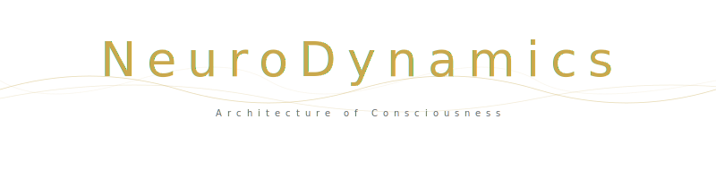

  

  
  

---

**NeuroDynamics Suite** — высокотехнологичный программный комплекс для генерации нейроакустических сессий и исследования глубоких состояний сознания. Проект представляет собой конвергенцию передовых психоакустических протоколов, математического моделирования и художественного саунд-дизайна.

## Научный фундамент
NeuroDynamics Suite оперирует на стыке нейробиологии и акустики, используя механизмы **Neural Entrainment** для управления нейронной активностью:
*   **DMN Deactivation:** Применение хаотических аттракторов Лоренца для временной деактивации Default Mode Network (сети пассивного режима мозга).
*   **Hippocampal Coupling:** Реализация CFC (Cross-Frequency Coupling), где гамма-ритмы модулируются фазой тета-волн, имитируя естественные паттерны обработки информации.
*   **Coherence Optimization:** Использование частот золотого сечения (φ=1.618) для создания гармонических структур с минимальным когнитивным сопротивлением.
*   **Respiratory Entrainment:** Ультра-медленная амплитудная модуляция (4–6 BPM), синхронизированная с ритмом дыхания для входа в состояние когерентности HRV.

## Технологическое ядро

### 1. Multi-Pathway Sound Engine
Система воздействует на мозг через три независимых и дополняющих друг друга канала:
*   **Binaural Beats:** Прецизионный фазовый сдвиг в HRTF-пространстве для воздействия на кору.
*   **Monaural Beats:** Прямая амплитудная модуляция (AM) несущей для влияния на стволовые структуры (эффективно даже без наушников).
*   **Isochronic Priming:** Начальные гамма-вспышки (FFR prime burst) для "разогрева" мозга перед погружением.

### 2. Organic Synthesis & DSP
Движок уходит от "стерильных" осцилляторов в сторону живого, органического звучания:
*   **Formant Resonator:** Банк адаптивных фильтров, имитирующих формантную структуру человеческого голоса.
*   **Tube Saturation:** Мягкое аналоговое насыщение (arctan soft-clip), добавляющее теплоту и четные гармоники.
*   **Synthetic Room Reverb:** Декоррелированная пространственная реверберация для создания эффекта бесконечного объема.
*   **4 Synthesis Modes:** Warm (FM), Rich (Additive), Soft (Pure), Organ (Drawbar).

### 3. Scientific Spatial Model (3D)
*   **Brown-Duda HRTF:** Физически корректная Head-Related Transfer Function.
*   **Woodworth ITD:** Расчет межушных временных задержек для формирования точного азимута.
*   **Lissajous Orbital:** Алгоритмическое движение источников по 3D-траекториям для предотвращения адаптации.

## Архитектура сессий
Каждая сессия — это математически выверенное путешествие:
1.  **FFR Prime:** Гамма-прайминг для настройки нейронного отклика.
2.  **Ignition:** Захват внимания и синхронизация с внешним ритмом.
3.  **Transition:** Бесшовный переход через тишину (Professional Crossfade) к более глубоким состояниям.
4.  **Void Core:** Максимальная глубина (Theta/Delta) с активной респираторной модуляцией.
5.  **Integration:** Мягкий возврат и фиксация состояния (Beta-lock).

## Протокол использования
*   **Оборудование:** Только проводные наушники. Bluetooth разрушает фазовую целостность сигнала.
*   **Громкость:** 15–30%. Звук должен быть комфортным и не навязчивым.
*   **Положение:** Лежа или полулежа, глаза закрыты.
*   **Регулярность:** Рекомендуемый цикл — не чаще одного раза в 48 часов.

## Структура проекта
*   **`psychoacoustic/`**: Ядро обработки сигналов и математических моделей.
*   **`genesis_generator.py`**: Интерактивный терминальный интерфейс управления.
*   **`renderer.py`**: Высокоточный рендеринг в FLAC 24-bit / 44.1kHz.
*   **`tests/`**: Набор автоматизированных тестов (Pytest) для контроля качества DSP.

---
**Author:** franklin-sys  
**Project:** NeuroDynamics Suite (2026)  
**Web:** [https://franklin-sys.vercel.app/](https://franklin-sys.vercel.app/)
